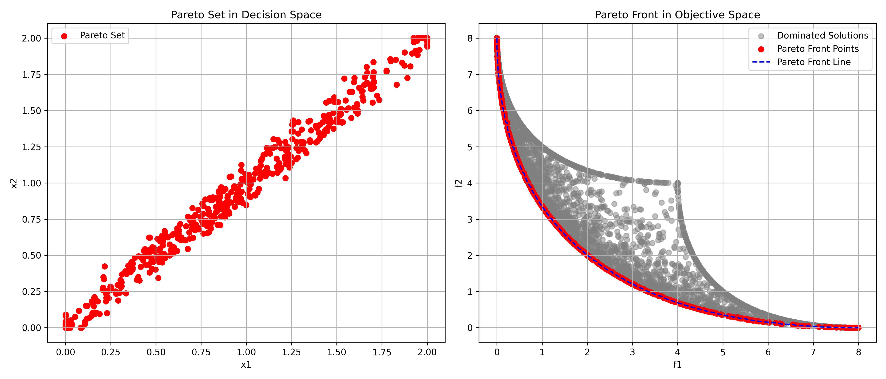

# Multi-objective Particle Swarm Optimization (MOPSO) for an artificial problem #

The MOPSO algorithm created v C++ searches for a set of non-dominated solutions (Pareto front) by optimizing two conflicting objectives.
Particles in the swarm represent potential solutions, moving through the decision space guided by personal and global best positions.

The problem is inspired by Example 20.2 in a book of Dan Simon (2013): Evolutionary Optimization Algorithms.
It implements the MOPSO algorithm to find the Pareto front for the following two objectives:
- **Objective 1:** $f_1(x_1, x_2) = x_1^2 + x_2^2$
- **Objective 2:** $f_2(x_1, x_2) = (x_1 - 2)^2 + (x_2 - 2)^2$

where $x_1$ is in $[0, 2]$  and $x_2$ in $[0, 2]$.

The **mopso_exampe.cpp** generates an output file _all_example_solutions.csv_ containing all evaluated solutions during the optimization process.
The CSV file can be used to visualize the Pareto set and Pareto front. Use the provided Python script **mopso_example_plot_pareto.py** to generate the plots.

The resulting graphs look as follows:

